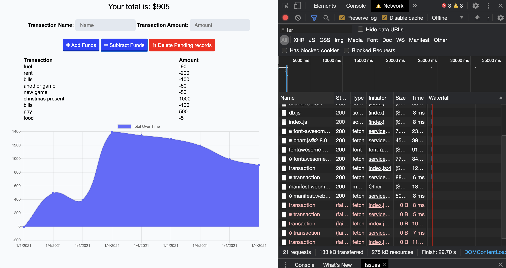
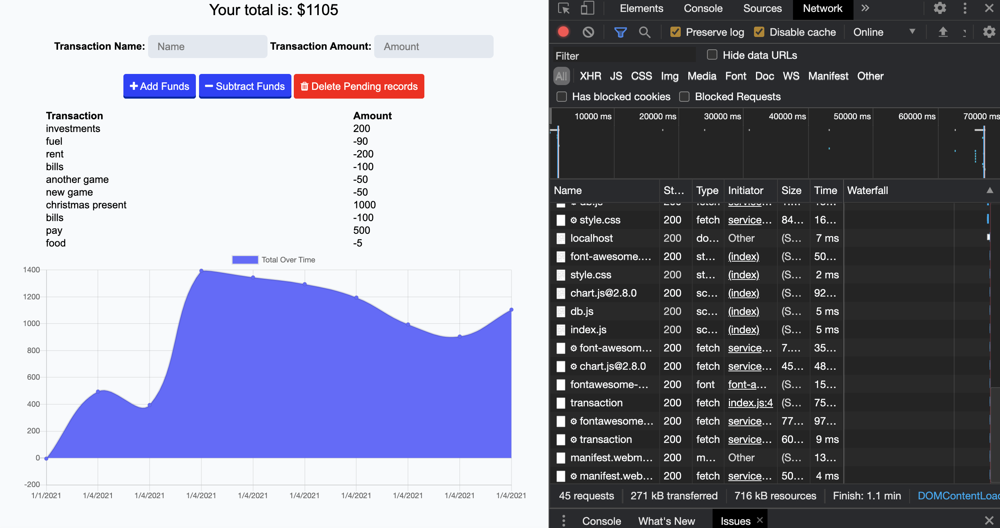

# Unit 18 PWA Homework: Online/Offline Budget Trackers

* Budget Tracker application is for a user to be able to update information while online/offline. Application has offline access and functionality.

* The user is able to add expenses and deposits to their budget with or without a online connection. When entering transactions offline, the total will be populated when brought back online.

Offline Functionality:

  * Enter deposits and expenses offline

When brought back online:

  * Offline entries added to tracker.

## Business Context

Giving users a fast and easy way to track their money is important, but allowing them to access that information anytime is even more important. Having offline functionality is paramount to our applications success.

## Deployed Application

- [Github repo!](https://github.com/Michaelmw17/Budget-Tracker)

* Offline image:

* Online image:

## Contacts

_Michael Watt_

- [Github!](https://github.com/Michaelmw17)
- [LinkedIn!](https://www.linkedin.com/in/michael-watt-6a76961b3/)
- [Portfolio!](http://michaelmw17.github.io/)
- [Email!](michaelmw17@outlook.com)
